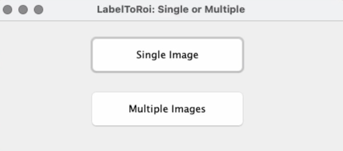
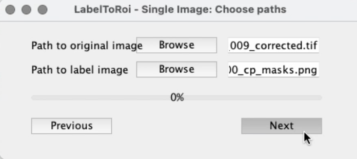
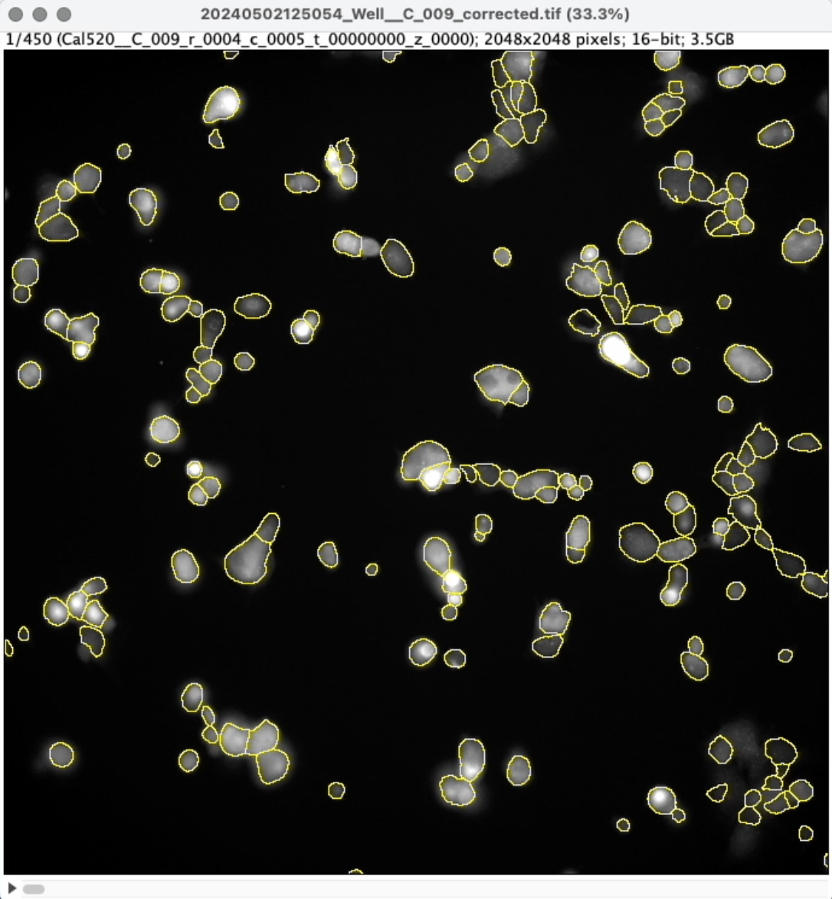
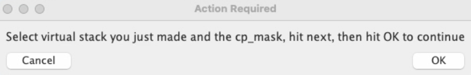

```{r setup, include=FALSE}
knitr::opts_chunk$set(echo = TRUE)
```

## Intensity Analysis for VALA Data

This is a pipeline in R and FIJI to analyze data from either calcium or voltage data collected on the VALA.

## Use Cellpose to Generate ROIs

To create ROIs to measure each cell at time points of choice, use [cellpose](https://www.cellpose.org/) to generate the ROIs. Follow the instructions for installation on the [github page](https://github.com/mouseland/cellpose). Once installed, to run cellpose, open the terminal and type the following command.

``` C
conda activate cellpose
```
Then run the next command to open the GUI

``` C
conda activate cellpose
```

## How To Run The Pipeline

To run the pipeline you need to edit the `parameter.R` and the file `intensity_analysis.R`, specifically you need to 1) add the path to the folder where the images from the experiment are 2) what rate you want to sample at and 3) where you want to save the files to.

```{r rename, echo = TRUE, eval = FALSE, include = TRUE}
#CHANGE THIS LINE
path = "~/Rao_lab_voltage_fluidics_20240516122405/scan/Well__C_009/Cal520"

#path to functions.R file
functions = "~/Documents/GitHub/intensity_analysis/R/startup/functions.R"

#rate at which experiment was acquired
fluovolt = 45
fluo8 = 30

#CHANGE THIS LINE
rate = 6

#paths to FIJI macros used to measure ROIs
macro1 <- "~/Documents/GitHub/intensity_analysis/R/macros/create_stack_measure_all_rois.ijm"

#FIJI path
fiji_executable <- "/Applications/Fiji.app/Contents/MacOS/ImageJ-macosx"

#CHANGE THIS LINE
move_folder <- "~/FOLDER_WHERE_YOU_WANT_TO_MOVE_FILES"
```

In the `intensity_analysis.R`, you need to edit this line of code below and change 'aq_rate' variable to the correct experiment - either fluo8 or fluovolt.

```{r pipeline, echo = TRUE, eval = FALSE, include = TRUE}
#CHANGE THIS LINE
aq_rate = fluo8
sample_rate <- rate
```

After changing the correct parameters, you can highlight the code in `intensity_analysis.R` and run!

## Walk through of What's Happening

The pipeline takes images from the folder where your experimental images are and moves them to a new folder (at the sampling rate that you defined). For example, if you acquired the images at 45hz (45 frames per sec) then if you want to sample at 5hz (or 5 frames per second), your defined rate should be 9 (which would grab every 9 frames).

Next, the pipeline runs the FIJI macro `create_stack_measure_all_rois.ijm`. This macro opens all of the files you moved as a virtual stack and then runs a photobleaching algorithmn on the virtual stack. The code then saves both images as virtual stacks to the same folder where the moved images are.

{width="432"}

Next the code, moves the cellpose mask you created from the folder you define (see below) and moves it to the folder where your moved images are. **NOTE: The code will only recognize the naming convention where the mask has the name of the the first image of your experiment (should have 00000000 to signify the first frame) followed by '\_cp_mask.png'**

``` javascript
//CHANGE THIS LINE OF CODE IN THE FIJI.IJM TO SPECIFY WHERE THE CELLPOSE MASKS ARE
mask_folder = "~/Desktop/cellpose_masks"; 
masks = getFileList(mask_folder);
```

Next, the code runs the [LabelsToROI](https://labelstorois.github.io/) FIJI plugin. This will open the LabelsToROI gui and prompt the user to enter the correct images. See steps below to select the correct images

1.  Select 'Single Image'

    {width="271"}

2.  For 'Path to original image' select the bleach corrected virtual stack should have the ending '\_corrected.tif'

3.  For 'Path to label image' select the cellpose mask that should have the ending '\_cp_mask.png'

4.  Hit 'Next' on the GUI

    {width="271"}

5.  **Wait for the GUI to run and open the virtual stack with the ROIs overlayed**

    {width="262"}

6.  Finally, hit 'OK' on the 'Action Required' panel

    {width="380"}

Finally, the code will run and generate a .csv file that has the measurements of the [mean intensity](https://forum.image.sc/t/how-does-imagej-calculate-intensity-mean-gray-value/11874) of each ROI at every time point. The macro will automatically quit and proceed to the next steps.

Finally, the code runs 2 functions. The first function calculates the delta F/F and takes the average fluorescence of the baseline (5 seconds) and subtracts that from all measurements. The second function calculates the time at every measurement.

```{r calculate, echo = TRUE, eval = FALSE, include = TRUE}
#calculates the delta F/F
calculate_DFF(new_folder_path,hz)

#calculates the time at every measurement
write_time(dff_file)
```

The code is shown below and outputs 2 different .csv files 'DFF_data.csv' and 'DFF_data_modified.csv' where the 'DFF_data.csv' is the calculated delta F/F values and the 'DFF_data_modified.csv' is the file with the calculated time in the first column.
